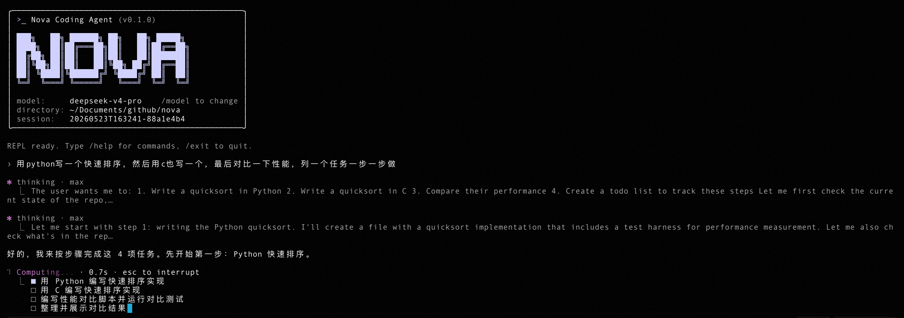

# Nova



> 一个跑在终端里的 coding agent，深度适配 DeepSeek。

Nova 是一个终端里的编码 agent —— 读代码、跑命令、改文件，通过工具调用把一项任务推到完成。内部消息走的是 Anthropic 的格式，但模型层是围绕 **DeepSeek** 做的：thinking 接到 DeepSeek 的 `output_config.effort`（而不是 Anthropic 的 `budget_tokens`），wire format 会根据模型 id 自动判断，默认 prompt 和权限规则也按 DeepSeek 的表现调过。其他 Anthropic 兼容端点也能跑，只是 DeepSeek 是第一优先级。

底层上 Nova 是一个 loop-centric 的 harness：`@nova/core` 提供模型无关的 agent loop，工具、权限、上下文管理、可观测性、编排这些都通过它暴露的 hook 和 observer 接入；`apps/cli` 把这些拼成可用的命令行 REPL（`harness`）。

当前状态：**M1 已交付**（基础 loop + bash/read/write + 权限 + transcript）；**M2 进行中** —— context memory 三层加载、micro/auto compact 已完成，prompt cache、hooks、cost/metrics 在路上。完整路线图见 `docs/M1-TODO.md` ~ `docs/M4-TODO.md`。

## 快速开始

环境要求：**Node ≥ 20**（见 `.nvmrc`），**pnpm 10.28.2**。

```bash
pnpm install
pnpm dev                                # 启动 REPL（tsx 运行 apps/cli/src/index.ts）
pnpm dev "帮我把这个函数加单测"          # 直接给出 prompt
```

首次启动会进入交互式配置向导写入 `~/.nova/nova.config.json`（API key、模型、session 目录等）。也可以手动编辑。

### CLI 常用参数

```bash
pnpm dev [prompt...]                # 直接发起一轮对话
  --model <name>                    # 临时覆盖模型
  --think off|low|medium|high|max   # 调整 extended thinking 预算
  --resume <session-id>             # 恢复指定 session
  --continue                        # 恢复最近一个 session
  --list-sessions                   # 列出历史 session
  --max-turns <n>                   # 单轮最大循环次数
  --no-transcript                   # 不写 transcript
  --no-pretty                       # 关闭 pino-pretty
```

### REPL 内置 slash 命令

```
/help              帮助
/model [<name>]    查看 / 切换模型
/think [<level>]   查看 / 切换 thinking 等级
/clear             清空会话历史（保留 session）
/compact [focus…]  把历史压缩成单条摘要消息
/resume [<id>]     切到指定 session（不带参数则从列表选）
/exit, /quit       退出
```

按 `Ctrl+D` 也能退出，按 `Esc` 中断当前回合。

## 仓库结构

```
packages/
  core           agent loop · model client · message/stop-reason 类型
  runtime        config (zod) · pino logger · session 存储
  tools          ToolRegistry · dispatcher · 内置工具（bash/read/write/edit/glob/grep/webfetch/websearch/ask-user/todo）
  safety         PermissionEngine · approval UI (Ink/React) · hooks (M2 W7)
  context        三层记忆加载（NOVA.md > CLAUDE.md > AGENTS.md）· micro/auto compact · cache (M2 W5)
  orchestration  TodoStore · todo 工具 · 后台任务
  observability  Transcript (JSONL) · cost/metrics (M2 W8)
  external       MCP / Skills / slash 命令解析（M2 W8 + M3 W9）
  multi-agent    subagent 隔离 + 摘要回注（M3 W10）
  isolation, sdk 预留位（M3/M4 启用）
apps/
  cli            harness 二进制入口（唯一在跑的 app）
  http, vscode   占位，未实现
eval/            replay harness + 黄金 case（不走主构建，eslint/tsconfig 已排除）
docs/            分阶段 TODO（M1 ~ M4）+ 设计笔记
```

`@nova/*` package 在 workspace 内通过 `./src/index.ts` 直接互相 import；发布时通过 `publishConfig` 切到 `dist/`。

## 数据落在哪

| 内容 | 路径 |
|------|------|
| 全局配置 | `~/.nova/nova.config.json` |
| 历史 session | `~/.nova/sessions/{id}/` |
| transcript (observer 事件流) | `~/.nova/sessions/{id}/transcript.jsonl` |
| 可重放 message 历史 | `~/.nova/sessions/{id}/messages.jsonl` |
| session 日志 | `~/.nova/sessions/{id}/session.log` |
| 记忆文件（项目层） | 从 cwd 向上递归，每层按 `NOVA.md` > `CLAUDE.md` > `AGENTS.md` 取最优先的一个（同目录不合并） |
| 记忆文件（用户层） | `~/.nova/NOVA.md` → `~/.claude/CLAUDE.md` → `~/.config/agents/AGENTS.md`（按顺序取第一个存在的） |

## 开发

```bash
pnpm build                # 全量构建（tsup，递归）
pnpm typecheck            # tsc --noEmit
pnpm test                 # vitest run
pnpm test:watch
pnpm vitest run path/to/file.test.ts   # 跑单个测试文件
pnpm vitest run -t "name"              # 按名字过滤
pnpm lint / pnpm lint:fix
pnpm format / pnpm format:check
```

单包脚本可通过 `pnpm --filter @nova/<name> <script>` 调用。测试文件按 `packages/*/src/**/*.test.ts(x)` 收集，和源码并排放。

新加协作者请先读：

- `CLAUDE.md` — 给 AI assistant 看的项目导览（架构约定、loop 契约、ESM `.js` 后缀、zod 边界等）
- `docs/M{当前阶段}-TODO.md` — 当下应该做什么；别把后续阶段的范围拉进来
- `agent-harness-loop-architecture.html` — 架构总图

## License

未指定。私有项目。
